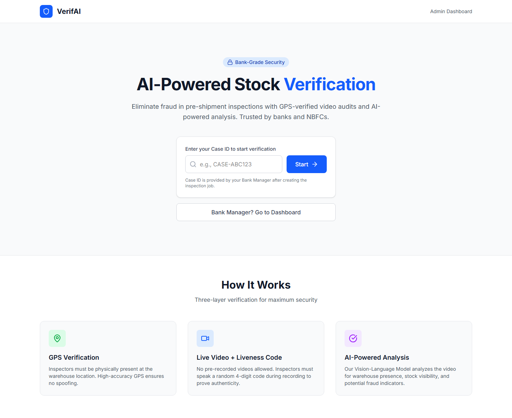
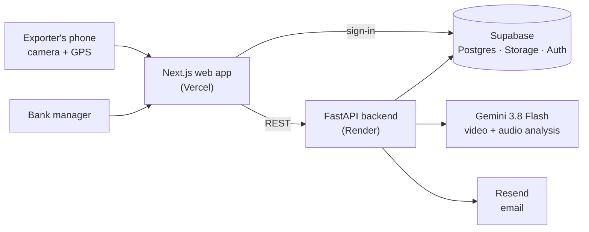

# VerifAI

**AI-verified remote stock inspections for pre-shipment finance.**

VerifAI replaces in-person stock inspections with a GPS-locked live video that an AI model audits. The exporter records the stock on their phone while speaking a one-time code, and Gemini 3.8 Flash checks the recording before a PDF certificate is emailed to the client.

**Live demo:** [verifai-mvp.vercel.app](https://verifai-mvp.vercel.app)



## The problem

Banks and NBFCs lend to exporters against stock that is about to be shipped (pre-shipment packing credit). Before releasing the loan, someone has to confirm the goods actually exist. Physical inspections are slow and expensive, and an inspector can be bribed to sign off on stock that isn't there.

## How it works

1. **Create a case.** A bank manager signs in and creates an inspection with the case ID, exporter, client email, warehouse GPS location and product type.
2. **Prove location.** The exporter opens the case on their phone. The app reads their GPS position and only continues if they are within 500 m of the warehouse.
3. **Prove liveness.** The server issues a random 4-digit code. The exporter records a live video of the stock and says the code out loud, so an old or borrowed video won't pass.
4. **AI audit.** The video is stored in Supabase and analysed by Gemini 3.8 Flash in three steps: was the code spoken correctly, does the stock match the expected product, and what condition is it in. The model returns a structured verdict: `APPROVED`, `REJECTED` or `MANUAL_REVIEW`, with fraud flags, a 0–100 confidence score and a one-line reason.
5. **Certificate.** A PDF certificate with the case details, timestamp, GPS location (with a map link) and the verdict is generated, stored and emailed to the client.
6. **Review.** Managers see every inspection in a dashboard, can watch the video, and can manually approve a case, which reissues the certificate.

## Architecture



| Layer | Technology |
|-------|------------|
| Web app | Next.js 16, React 19, TypeScript, Tailwind CSS |
| API | Python, FastAPI |
| AI | Google Gemini 3.8 Flash (`google-genai`) |
| Data, files and sign-in | Supabase (Postgres, Storage, Auth) |
| Reports and email | fpdf2, Resend |
| Hosting | Vercel (web app), Render (API) |

```
verif-ai/
├── frontend/   Next.js app: landing page, inspection flow (/verify/[id]), manager login and dashboard (/admin)
├── backend/    FastAPI app: main.py (API), ai_engine.py (Gemini audit), report_generator.py (PDF)
└── docs/       Screenshots
```

## API

Manager routes need an `Authorization: Bearer <Supabase access token>` header from a user whose email is listed in `ADMIN_EMAILS`.

| Method | Endpoint | Access | Purpose |
|--------|----------|--------|---------|
| `GET` | `/` | Public | Health check |
| `POST` | `/create-inspection` | Manager | Create an inspection case |
| `POST` | `/initiate-session` | Public | Check the exporter's GPS and issue the one-time code |
| `POST` | `/upload-video/{session_id}` | Public | Upload the video (after the GPS check, until the case has a verdict, 100 MB max), run the AI audit, create and email the certificate |
| `GET` | `/admin/inspections` | Manager | List all inspections |
| `POST` | `/admin/force-verify/{session_id}` | Manager | Manually approve a case and reissue the certificate |

## Running locally

**Requirements:** Python 3.10+, Node.js 20.9+, a Supabase project, a Gemini API key and a Resend API key.

**1. Supabase.** Create two public storage buckets, `Videos` and `Reports`, add a manager user under Authentication and turn off new user sign-ups, and create the table the backend uses:

```sql
create table inspections (
  case_id           text primary key,
  exporter_name     text,
  client_email      text,
  product_type      text default 'General Goods',
  target_lat        double precision,
  target_long       double precision,
  gps_lat           double precision,
  gps_long          double precision,
  verification_code text,
  status            text default 'pending',
  video_url         text,
  ai_result         jsonb,
  report_url        text,
  created_at        timestamptz default now()
);
```

**2. Backend** (runs on `http://localhost:8000`):

```bash
cd backend
python -m venv .venv && source .venv/bin/activate
pip install -r requirements.txt
cp .env.example .env      # fill in the values below
uvicorn main:app --reload
```

| Variable | Purpose |
|----------|---------|
| `GEMINI_API_KEY` | Gemini API access |
| `SUPABASE_URL`, `SUPABASE_KEY` | Supabase project URL and key |
| `RESEND_API_KEY` | Sending certificate emails |
| `REPORT_EMAIL` | Fallback recipient when a case has no client email |
| `ADMIN_EMAILS` | Comma-separated emails of the managers who can use the manager routes |

**3. Frontend** (runs on `http://localhost:3000`):

```bash
cd frontend
npm install
cp .env.example .env.local   # NEXT_PUBLIC_API_URL=http://localhost:8000, plus your Supabase URL and anon key
npm run dev
```
